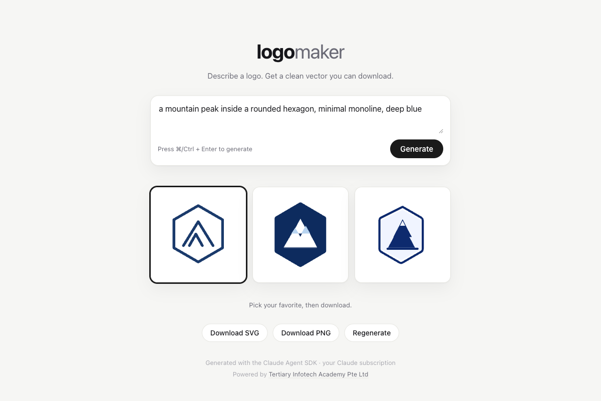
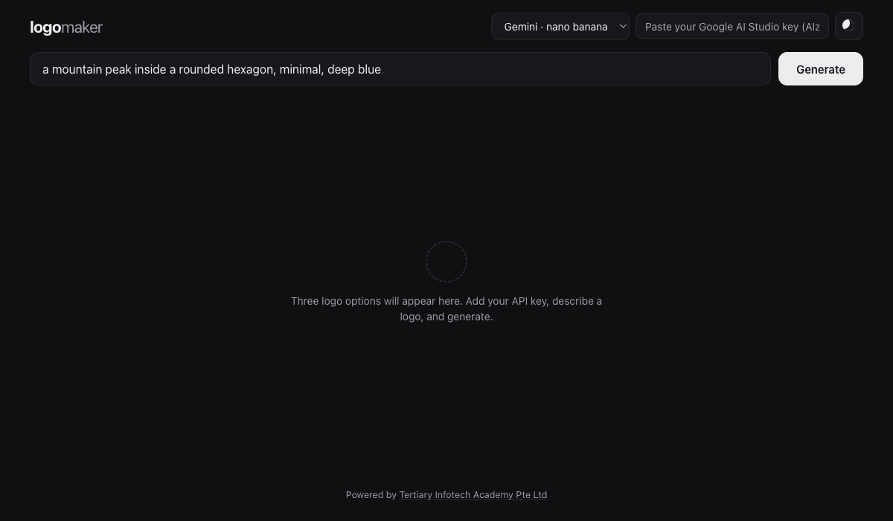
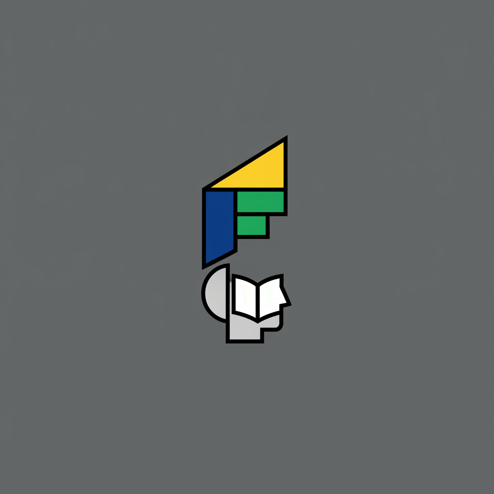
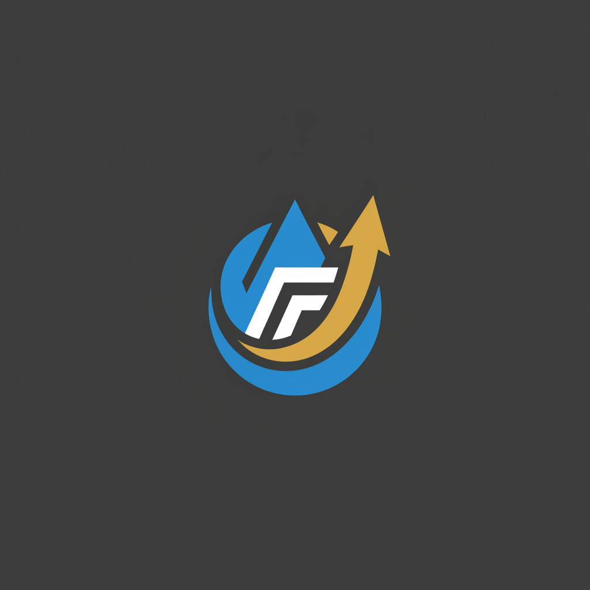

<div align="center">

# logomaker

[](#)
[](https://ai.google.dev/)
[](https://platform.openai.com/)
[](https://alfredang.github.io/logomaker/)
[](#license)

**Describe a logo, generate three options with Gemini (nano banana) or OpenAI, pick one, and download it as PNG — all in the browser. Bring your own API key.**

[Live Demo](https://alfredang.github.io/logomaker/) · [Report Bug](https://github.com/alfredang/logomaker/issues) · [Request Feature](https://github.com/alfredang/logomaker/issues)

</div>

## Screenshot

| Light | Dark |
|-------|------|
|  |  |

## Example

Prompt: **"finance consultant"** — three options generated with Gemini (nano banana):

| Option 1 | Option 2 | Option 3 |
|:--------:|:--------:|:--------:|
|  |  |  |

Pick one and download it as a PNG.

## About

**logomaker** is a zero‑backend web app for generating logos from a text description. Type what you want, and it asks an image model for **three logo options** that appear side by side. Pick your favorite and download it as a **PNG**.

It runs entirely in the browser as a static site and uses **your own API key** — choose **Google Gemini 2.5 Flash Image ("nano banana")** or **OpenAI `gpt-image-1`**. Your key is stored only in your browser (`localStorage`) and is sent directly to the provider you select; there is no server in between.

### Features

- **Describe → design** — generate a logo from a single plain‑language prompt.
- **Three options per request** — distinct directions, generated in parallel.
- **Bring your own key** — Gemini (nano banana) or OpenAI; the key lives only in your browser.
- **Pick & download** — select any option and download it as a **transparent PNG, cropped to the logo** (background removed, no square padding).
- **Dark / light theme** — one‑click toggle, remembers your choice.
- **Full‑width, single‑view UI** — fits one screen, no page scroll.
- **No backend, no build** — pure HTML/CSS/JS, deployed on GitHub Pages.

## Tech Stack

| Category | Technology |
|----------|------------|
| Frontend | HTML, CSS, vanilla JavaScript (no framework, no build) |
| Image model | [Google Gemini 2.5 Flash Image](https://ai.google.dev/) ("nano banana") · [OpenAI `gpt-image-1`](https://platform.openai.com/docs/guides/images) |
| Auth | User‑supplied API key, stored in `localStorage`, called directly from the browser |
| Hosting | GitHub Pages (deployed via GitHub Actions) |

## Architecture

```
┌──────────────────────────────────────────────────────────────┐
│  Browser  (static HTML / CSS / JS on GitHub Pages)           │
│                                                              │
│   describe + API key                                         │
│        │                                                     │
│        ├── 3 parallel image requests ──▶  Gemini  (nano banana)  │
│        │                              └─▶  OpenAI (gpt-image-1)   │
│        │                                                     │
│   3 option tiles ◀── PNG images ───────────────────────────  │
│   pick one ──▶ download PNG                                   │
└──────────────────────────────────────────────────────────────┘
```

> There is **no server**. The browser calls the image API directly with the key you paste in. This is why it can be hosted as a fully static site on GitHub Pages.

## Project Structure

```
logomaker/
├── public/
│   ├── index.html     # full-width, single-viewport UI: provider+key, theme toggle, 3 tiles
│   ├── style.css      # light/dark themes, responsive layout
│   └── app.js         # client-side Gemini/OpenAI image generation, key storage, PNG download
├── .github/workflows/
│   └── deploy.yml      # deploys public/ to GitHub Pages via Actions
├── CLAUDE.md          # project + contributor guidelines
└── README.md
```

## Getting Started

### Use the live site

1. Open **[the live demo](https://alfredang.github.io/logomaker/)**.
2. Choose a provider (**Gemini · nano banana** or **OpenAI**) and paste your API key.
   - Gemini key: [Google AI Studio](https://aistudio.google.com/app/apikey)
   - OpenAI key: [OpenAI API keys](https://platform.openai.com/api-keys)
3. Describe your logo, click **Generate**, pick your favorite, and **Download PNG**.

### Run locally

No build step — just serve the `public/` folder with any static server:

```bash
git clone https://github.com/alfredang/logomaker.git
cd logomaker/public
python3 -m http.server 4500
# open http://localhost:4500
```

> A static server (or the live site) is recommended over opening the file directly, so the browser treats it as a normal web origin.

## Deployment

The site is deployed to **GitHub Pages via GitHub Actions** ([`.github/workflows/deploy.yml`](.github/workflows/deploy.yml)). On every push to `main`, the workflow uploads `public/` and publishes it. To deploy your own fork: enable **Settings → Pages → Build and deployment → GitHub Actions**, then push to `main`.

## Notes & Limitations

- **Your key, your browser.** The API key is stored in `localStorage` and sent straight to Google/OpenAI from your browser. Use a key scoped/limited to your usage. Don't use this pattern with a shared or privileged key.
- **CORS.** Gemini's Generative Language API supports direct browser calls. OpenAI may restrict browser‑origin requests depending on your account/region; if a request is blocked, switch to Gemini.
- **Raster output.** Image models return PNG (raster), so downloads are PNG — not vector SVG.
- **Transparent + cropped.** The app removes the (uniform) background in‑browser via edge flood‑fill and crops to the logo's bounding box. This works best when the logo sits on a plain background with margin (which the prompt requests); textured or gradient backgrounds may not key out cleanly.
- **Model name.** The Gemini image model id is set in `app.js` (`GEMINI_MODEL`); update it there if Google renames it.

## Contributing

1. Fork the repository
2. Create a feature branch (`git checkout -b feature/your-idea`)
3. Commit your changes
4. Open a Pull Request

See [CLAUDE.md](CLAUDE.md) for the project's working guidelines.

## License

Released under the MIT License.

## Developed By

**[Tertiary Infotech Academy Pte. Ltd.](https://www.tertiaryinfotech.com/)**

## Acknowledgements

- [Google Gemini](https://ai.google.dev/) ("nano banana", Gemini 2.5 Flash Image) and [OpenAI Images](https://platform.openai.com/docs/guides/images)
- Built with [Claude Code](https://claude.com/claude-code)

<div align="center">

⭐ If you find this useful, consider starring the repo.

</div>
